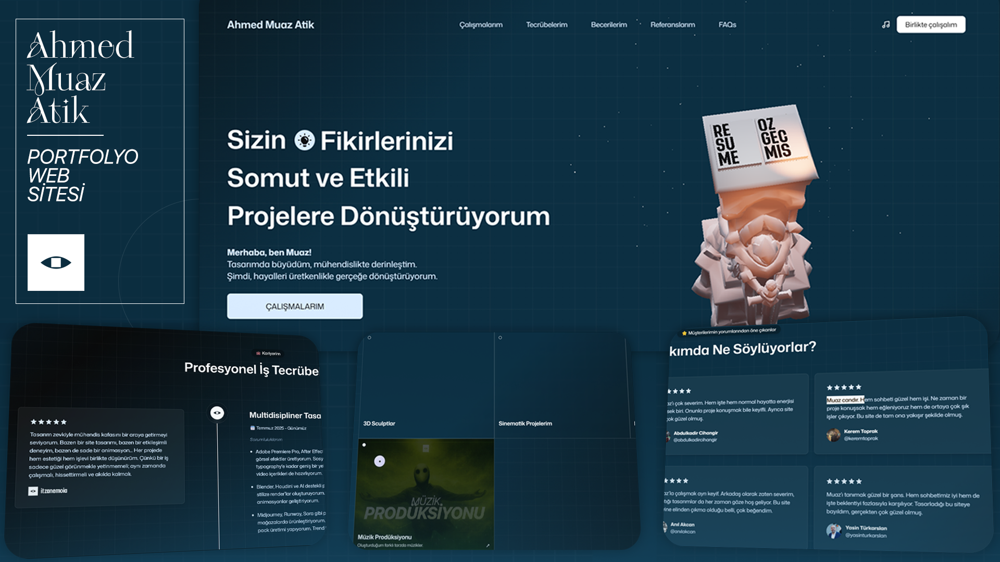

<h1 align="center">🌐 Ahmed Muaz Atik — Portfolyo Web Sitesi</h1>

  <em>Modern web teknolojileri, yüksek etkileşim ve güçlü görsel tasarımın birleştiği kişisel portfolyo projem.</em>

<h2>📌 Proje Hakkında</h2>

  Bu portfolyo, <strong>profesyonel geçmişimi, projelerimi ve teknik becerilerimi</strong> etkileyici bir şekilde sunmak için tasarlandı.
  Her detayında kullanıcı deneyimini ön planda tutan, <strong>modern ve etkileşimli</strong> bir yapı tercih edildi.
  Web teknolojilerinde edindiğim bilgi ve deneyimi, hem estetik hem de performans odaklı bir tasarım anlayışıyla birleştirdim.

<h2>🚀 Kullanılan Teknolojiler</h2>
<ul>
  <li>⚛️ <strong>React</strong> — Bileşen tabanlı, dinamik kullanıcı arayüzleri</li>
  <li>🌌 <strong>Three.js</strong> — 3D sahneler ve etkileşimli öğeler</li>
  <li>🎯 <strong>GSAP</strong> — Yüksek performanslı animasyonlar</li>
  <li>🎨 <strong>TailwindCSS</strong> — Hızlı, modern ve responsive tasarım</li>
  <li>⚡ <strong>Vite</strong> — Geliştirme sürecinde yüksek hız ve optimizasyon</li>
  <li>🌀 <strong>Blender</strong> — 3D modelleme, sahne tasarımı ve animasyon</li>
</ul>

<h2>✨ Öne Çıkan Özellikler</h2>
<ul>
  <li>🔹 <strong>Görsel Odaklı Tasarım:</strong> Minimalizm ile estetiği birleştiren modern arayüz</li>
  <li>🔹 <strong>3D Deneyim:</strong> Blender ve Three.js ile geliştirilmiş özel sahneler</li>
  <li>🔹 <strong>Etkileşimli Unsurlar:</strong> Custom cursor, scroll animasyonları, geçiş efektleri</li>
  <li>🔹 <strong>Mobil Uyumluluk:</strong> Tüm cihazlarda kusursuz görünüm</li>
  <li>🔹 <strong>Performans Optimizasyonu:</strong> Lazy load, kod bölme ve hafif yapılar</li>
</ul>

<h2>📸 Önizleme</h2>

<h2>📜 Lisans ve Haklar</h2>

  Bu projenin tüm kod, tasarım, görsel ve 3D model hakları <strong>Ahmed Muaz Atik</strong>’e aittir.
   İzinsiz kopyalanamaz, dağıtılamaz veya ticari amaçla kullanılamaz.

<em>Detaylı lisans bilgisi için <code>LİSANS</code> dosyasına bakabilirsiniz.</em>

<h2>📬 İletişim</h2>
<ul>
  <li>📧 <strong>E-posta:</strong> <a href="mailto:itzanemoia@gmail.com">itzanemoia@gmail.com</a></li>
  <li>🌐 <strong>Website:</strong> <a href="https://ahmedmuazatik.github.io/" target="_blank">ahmedmuazatik.github.io</a></li>
</ul>
